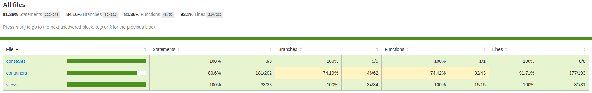
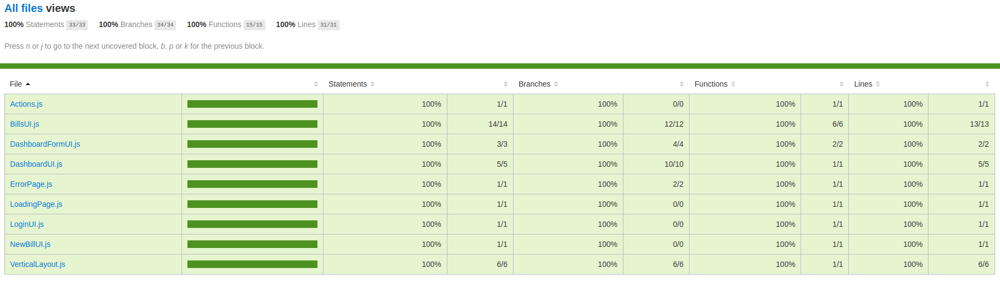
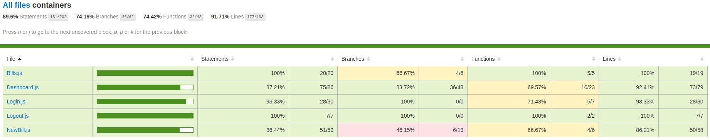

# Billed

## Debugging and testing a **SaaS HR** system 📊

The Billed expense report application is full of bugs.

**Fix** the code and implement **unit** and **integration tests** so that this is no longer the case.

## Toolbox 🧰

- [Infos](https://github.com/git504/Billed/tree/main/Public/Tools)
- [Backend](https://github.com/OpenClassrooms-Student-Center/Billed-app-FR-back)
- [Frontend](https://github.com/OpenClassrooms-Student-Center/Billed-app-FR-Front)
- [Bugs & tests **TO DO**](https://www.notion.so/a7a612fc166747e78d95aa38106a55ec?v=2a8d3553379c4366b6f66490ab8f0b90)

## Deliverables 🚚

To implement the Units and integration tests, the [Jest framework](https://jestjs.io/fr/) was used with [@testing-library/jest-dom](https://testing-library.com/).

Coverage ratio : at least 80% (unit & integration tests).

1. [First, read the E2E plan for the employee route](https://github.com/git504/Billed/blob/main/Public/Deliverables/End-To-End%20plan%20for%20the%20employee%20route.pdf)

2. Check the Jest code **coverage** report screenshot

3. Check the **UI-views** screenshot

4.  Check the **UX-containers** screenshot

---

[**Fixed** by git504](https://github.com/git504)
